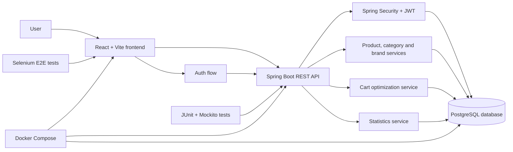

# Grocery Guide


**Grocery Guide** is a full-stack grocery price comparison application. It helps users browse products, build a shopping list, and compare grocery prices across supported stores so they can find the cheapest option for their basket.

---

## Overview

The application is split into three main parts:

| Area | Purpose | Main tools |
| --- | --- | --- |
| Frontend | User interface, routing, protected pages, shopping list view | React, Vite, Tailwind CSS, MUI, shadcn/ui-style components |
| Backend | REST API, authentication, product search, cart optimization | Spring Boot, Spring Security, JWT, JPA |
| Database | Product, brand, category, store and cart persistence | PostgreSQL |
| Testing | Unit, integration and end-to-end coverage | JUnit, Mockito, Selenium |

### Architecture



---

## Features

- Product browsing with pagination and filtering
- Product search by name, category and brands
- User registration, login, refresh token handling and logout
- Protected shopping list and category pages
- Shopping cart management with quantity updates and checked items
- Full cart optimization for comparing store prices
- Store, brand, category and statistic API endpoints
- Swagger/OpenAPI documentation for backend endpoints
- Docker-based local development setup
- GitHub Actions workflow with automated checks

---

## Tech Stack

| Layer | Technologies |
| --- | --- |
| Frontend | React 19, Vite, React Router, Tailwind CSS, MUI, Radix UI, lucide-react |
| Backend | Java 17, Spring Boot 3.2.2, Spring Web, Spring Security, Spring Data JPA |
| Auth | JWT access tokens and HTTP-only refresh token cookie |
| Database | PostgreSQL 15, H2 for tests |
| API docs | springdoc-openapi / Swagger UI |
| DevOps | Docker, Docker Compose, Render config |
| Tests | JUnit, Mockito, Spring Boot Test, Selenium |

---

## Project Structure

```text
GroceryGuide/
+-- backend/                 # Spring Boot REST API
+-- frontend/                # React + Vite client
+-- selenium/                # End-to-end tests
+-- docker-compose.yaml      # Local development stack
+-- docker-compose.prod.yaml # Production-oriented compose file
+-- docker-compose.e2e.yml   # End-to-end test stack
+-- FEATURES.md              # Feature ideas and user stories
`-- README.md                # Project documentation
```

---

## Getting Started

### Requirements

- Docker and Docker Compose
- Java 17
- Node.js and npm
- PostgreSQL, if running without Docker

### Run with Docker

Create a `.env` file in the project root:

```env
DB_NAME=groceryguide
DB_USERNAME=your_username
DB_PASSWORD=your_password
```

Start the full local stack:

```bash
docker compose up --build
```

Default local services:

| Service | URL |
| --- | --- |
| Frontend | http://localhost:3000 |
| Backend API | http://localhost:8080 |
| PostgreSQL | localhost:5432 |

### Run Frontend Locally

```bash
cd frontend
npm install
npm run dev
```

### Run Backend Locally

```bash
cd backend
./mvnw spring-boot:run
```

On Windows PowerShell:

```powershell
cd backend
.\mvnw.cmd spring-boot:run
```

---

## API Highlights

| Endpoint group | Description |
| --- | --- |
| `/api/auth` | Register, login, refresh token and logout |
| `/api/products` | Product listing and filtered search |
| `/api/cart` | Shopping cart operations and optimized cart results |
| `/api/categories` | Product categories |
| `/api/brands` | Brand data |
| `/api/stores` | Store data |
| `/api/statistics` | Basic application statistics |

Swagger UI is available when the backend is running:

```text
http://localhost:8080/swagger-ui/index.html
```

---

## Testing

Backend tests:

```bash
cd backend
./mvnw test
```

Frontend checks:

```bash
cd frontend
npm run lint
npm run build
```

End-to-end tests are kept in the `selenium/` module and are intended to verify real user flows such as login and navigation.

---

## CI/CD

The project follows a Git-based workflow:

- Feature branches for new work
- Pull requests before merge
- Automated build and test checks
- Unit, integration and Selenium test coverage in the workflow

Only verified changes should be merged into the main branch.

---

## Team

This project was developed by a team of four:

| Name | GitHub |
| --- | --- |
| Zoli | [@zoleman](https://github.com/zoleman) |
| Bobita | [@pbobita](https://github.com/pbobita) |
| Aron | [@aron166](https://github.com/aron166) |
| Peter | [@PeterKokenyessy](https://github.com/PeterKokenyessy) |

---

## Notes

The frontend uses shadcn/ui-style generated components under `frontend/src/components/ui`. These components are part of the source code instead of being installed as a separate npm package.
